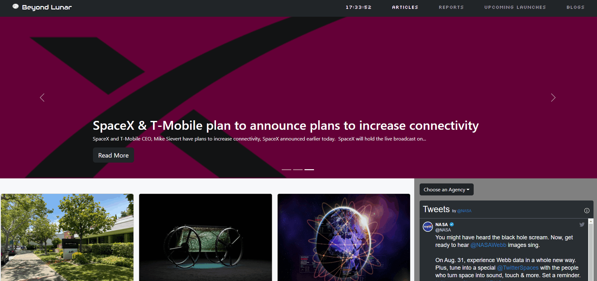

# **Welcome to Beyond Lunar!**

Beyond Lunar is a Space News website. We sourced our data through calls to several APIs aggregated onto one page: we use the SpaceNews API to get our articles and reports and blogs, we use the Space Devs API to get launch data, and we source the Twitter API for their widget (use of fetch() function to make GET requests to these APIs).

On our site, you can check everything that's going on with new space discoveries from articles, blogs, and even a live Twitter feed from some of the <em>biggest</em> space agencies in the world.

## Features

Let's run down on all the features of our Beyond Lunar website:

- Our web page shows a carousel of pictures with links to articles and main updates. To cycle through, use your left and right keyboard arrow keys ('keydown' event listener) or click on the screen arrow keys. To read the full article, click on "Read More".

- The navbar buttons on the top right corner allow you to select "Articles", "Reports", "Upcoming Launches" and "Blogs". Click those options to populate the page with your selected type of content: article, reports, launches, or blogs ('click' event listener and forEach loop use).

  

- The navbar also has a clock updates by the second.

- To the bottom right of the page, you can see a Twitter feed for some of the biggest space agencies in the world. By selecting an option in our dropdown menu, "Choose an Agency", you can select which agency's feed you would like to see. 

  

- Finally, our last and most exciting function: by moving your mouse over the Moon logo to the top left of the page ('mouseover' event listener), it will progress through the different phases of the moon! (animated by me)

  

# We hope you enjoy getting your space news from Beyond Lunar!

